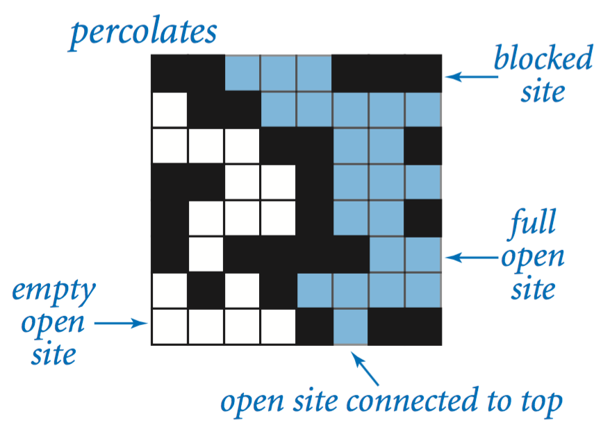
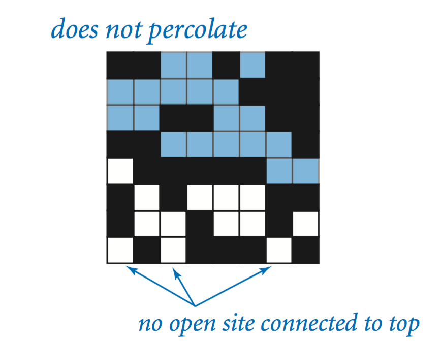
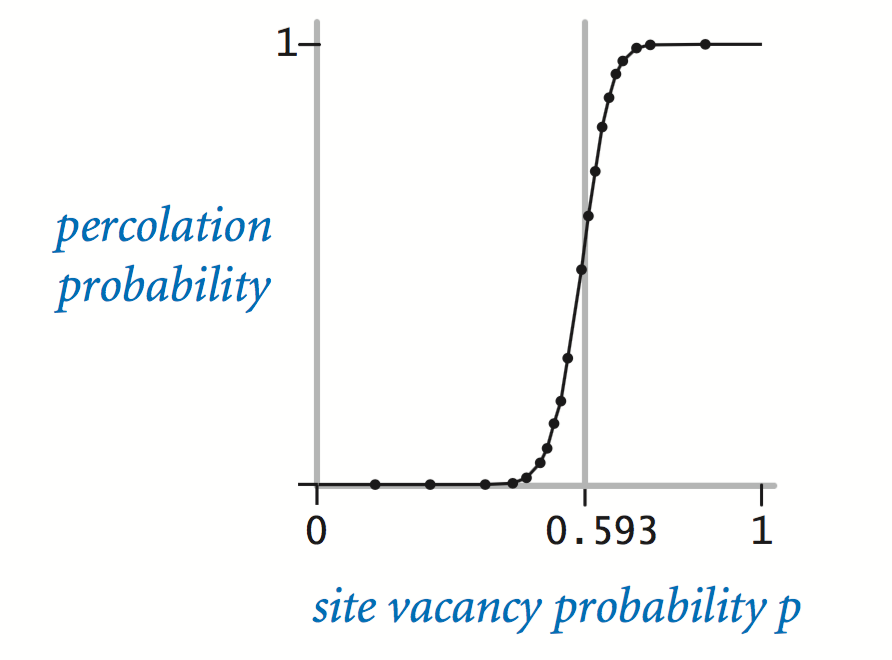
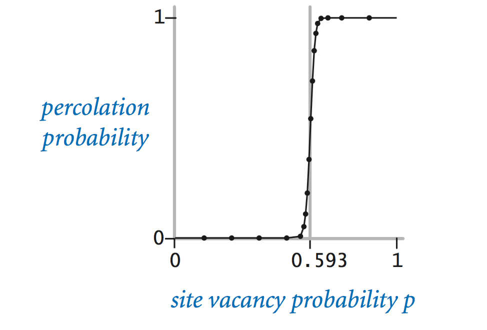
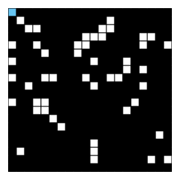
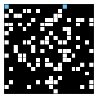
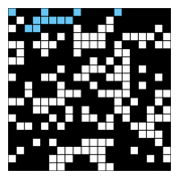
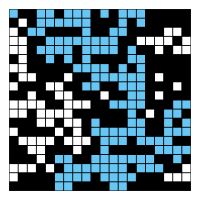
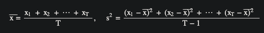

# Percolation (Monte Carlo simulation)

Given a composite systems comprised of randomly distributed insulating and metallic materials: what fraction of the materials need to be metallic so that the composite system is an electrical conductor? Given a porous landscape with water on the surface (or oil below), under what conditions will the water be able to drain through to the bottom (or the oil to gush through to the surface)? Scientists have defined an abstract process known as percolation to model such situations.

## The model

We model a percolation system using an n-by-n grid of sites. Each site is either open or blocked. A full site is an open site that can be connected to an open site in the top row via a chain of neighboring (left, right, up, down) open sites. We say the system percolates if there is a full site in the bottom row. In other words, a system percolates if we fill all open sites connected to the top row and that process fills some open site on the bottom row. (For the insulating/metallic materials example, the open sites correspond to metallic materials, so that a system that percolates has a metallic path from top to bottom, with full sites conducting. For the porous substance example, the open sites correspond to empty space through which water might flow, so that a system that percolates lets water fill open sites, flowing from top to bottom.)

percolates           does not percolate

## The problem

In a famous scientific problem, researchers are interested in the following question: if sites are independently set to be open with probability p (and therefore blocked with probability 1 − p), what is the probability that the system percolates? When p equals 0, the system does not percolate; when p equals 1, the system percolates. The plots below show the site vacancy probability p versus the percolation probability for 20-by-20 random grid and 100-by-100 random grid.

   
When n is sufficiently large, there is a threshold value p* such that when p < p* a random n-by-n grid almost never percolates, and when p > p*, a random n-by-n grid almost always percolates. No mathematical solution for determining the percolation threshold p* has yet been derived. Your task is to write a computer program to estimate p*.

## Corner cases

By convention, the row and column indices are integers between 1 and n, where (1, 1) is the upper-left site: Throw an IllegalArgumentException if any argument to open(), isOpen(), or isFull() is outside its prescribed range. Throw an IllegalArgumentException in the constructor if n ≤ 0.

## Performance requirements

The constructor must take time proportional to n2; all instance methods must take constant time plus a constant number of calls to union() and find().

## Monte Carlo simulation

To estimate the percolation threshold, consider the following computational experiment:

Initialize all sites to be blocked.
Repeat the following until the system percolates:  
Choose a site uniformly at random among all blocked sites.  
Open the site.  
The fraction of sites that are opened when the system percolates provides an estimate of the percolation threshold.
For example, if sites are opened in a 20-by-20 lattice according to the snapshots below, then our estimate of the percolation threshold is 204/400 = 0.51 because the system percolates when the 204th site is opened.

  
50 open sites
100 open sites
150 open sites
204 open sites Respectively

By repeating this computation experiment T times and averaging the results, we obtain a more accurate estimate of the percolation threshold. Let xt be the fraction of open sites in computational experiment t. The sample mean x⎯⎯⎯
 provides an estimate of the percolation threshold; the sample standard deviation s; measures the sharpness of the threshold.

  
Assuming T is sufficiently large (say, at least 30), the following provides a 95% confidence interval for the percolation threshold:

## Critera for the assignment:

Implement the Percolation data type using:

- quick find algorithm
- weighted quick union algorithm

For each of the above:  

- measure the total running time of PercolationStats for various values of n and T. How does doubling n affect the total running time? How does doubling T affect the total running time? Give a formula (using tilde notation) of the total running time on your computer (in seconds) as a single function of both n and T
- give the total memory usage in bytes (using tilde notation) that a Percolation object uses to model an n-by-n percolation system. Count all memory that is used, including memory for the union–find data structure.