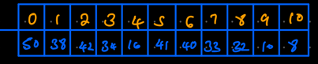

A heap is a tree-like structure whose underlying structure is an array.  
It can be expressed as a complete tree because all the levels are full except for the lowest level, where some nodes can be empty but all are on the left.  
The structure makes it that the first element is either the smallest or the largest element, 
depending on the desired order.  
The heap behaviour is such that whenever data is added, the position of the element is computed.  
The advantage is that you can very easily get the largest/smallest value without any computation (compared to a no array, for instance)  
Example  
  
The relationship between the array elements (nodes in the heap) is governed by the formula:  
Left child = (2X+1), Right child = (2X+2)  
  
Every node has a child that is smaller.  

At it's least efficiency, the time complexity is O(log n)  

